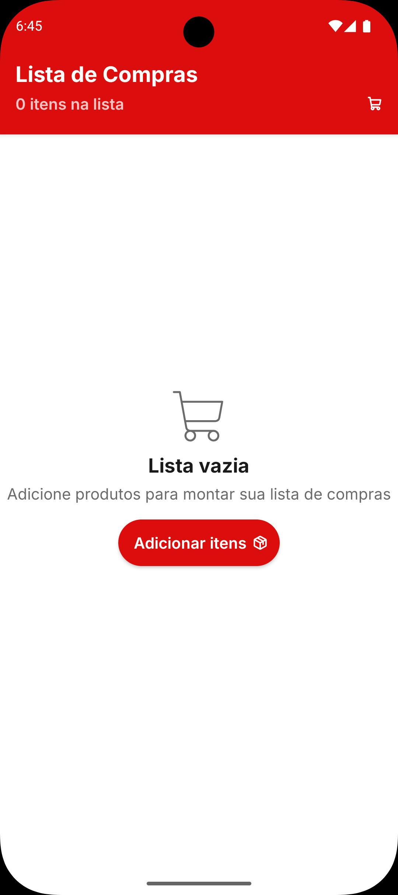
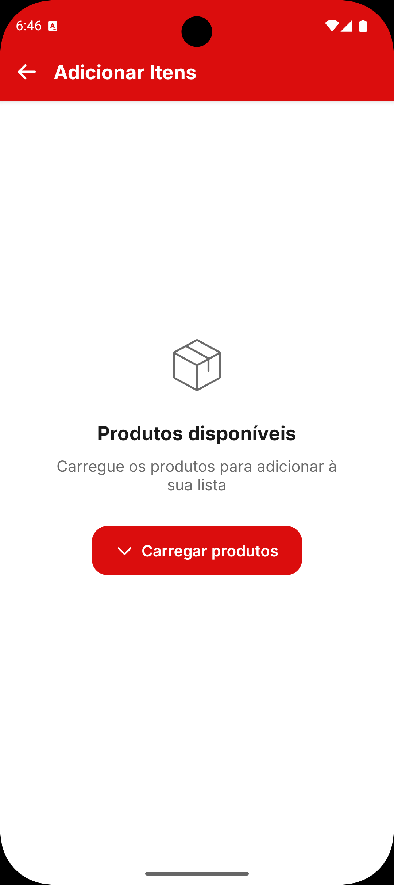
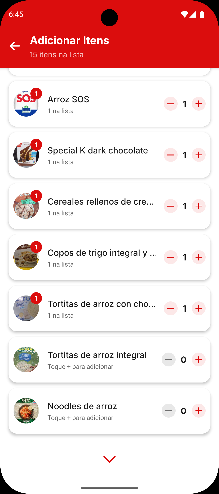

# 📸 Screenshots do App

Capturas de tela do aplicativo SupermarketList.

## Tela Principal - Lista de Compras

### Estado Vazio

  

Tela inicial quando não há itens na lista de compras. Exibe mensagem de estado vazio com
botão para adicionar produtos.

### Com Itens Adicionados

  

Tela principal mostrando a lista de compras preenchida com produtos e suas quantidades.
Exibe contador total de itens e permite ajustar quantidades.

## Tela de Seleção de Produtos

### Visualização Inicial

  

Tela com a listagem de produtos disponíveis para adicionar à lista. Permite navegar por
centenas de produtos com scroll infinito.

### Com Produtos Selecionados

  

Mostra produtos já adicionados à lista com suas quantidades. Interface permite incrementar
ou remover produtos diretamente da tela de seleção.
